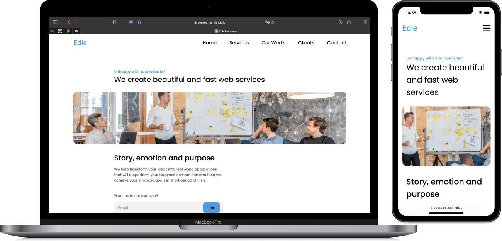

C'est la page d'accueil d'une agence digitale, **Edie**, `mobile first`, `responsive`, développée en `HTML`, `CSS`, et `JavaScript`.

C'est un <a href="https://devchallenges.io/challenges/xobQBuf8zWWmiYMIAZe0">`challenge`</a> de `devchallenge.io`.

Visiter le site en cliquant sur l'image ci-dessous ou sur le lien en bas de la section `About`.

`Note : il s'agit là d'une ancienne réalisation dont je viens de nettoyer l'historique des commits.`

<a href = "https://yousoumar.github.io/edie/"></img></a>
